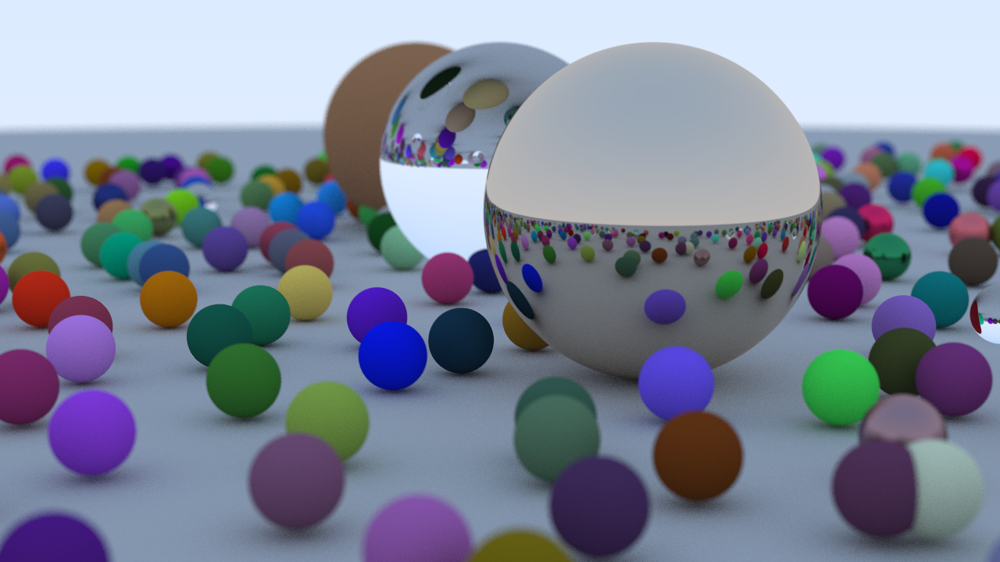

# C++ Ray Tracer

A simple, CPU-based ray tracer built in C++ by following Peter Shirley's "Ray Tracing in One Weekend" book series. This project serves as a personal exploration into the fundamentals of computer graphics and rendering algorithms.

[Source](images/final_render.png) 

## About This Project

This program generates photorealistic images by simulating the path of light rays as they interact with objects in a 3D scene. The implementation is based on the concepts from the "Ray Tracing in One Weekend" series, which covers the essentials of writing a path tracer from scratch.

## Features Implemented

- [x] Vector and Ray utility classes
- [x] Basic object rendering (spheres)
- [x] Surface normals and shading
- [x] Hittable objects and lists
- [x] Anti-aliasing using multisampling
- [x] Diffuse (Lambertian) materials
- [x] Metal materials with reflection
- [x] Dielectric materials with refraction (glass, water)
- [x] Positionable camera with depth of field

## Getting Started

### Prerequisites

To build and run this project, you will need:
- A modern C++ compiler (C++17 or newer)
- [CMake](https://cmake.org/download/) (version 3.10 or higher)
- [Git](https://git-scm.com/downloads)
- Your preferred Code-Editor

### Building the Project

#### For Visual Studio:

Follow these steps to clone and build the ray tracer from source:
1. Clone the repo to your machine by running the following command: 

   git clone https://github.com/Harkaran-Gill/RayTracer.git

2. Create a build directory  
   cmake -B build

3. Build the project
   This will create an executable in the build directory  
   cmake --build build --config Release

#### For CLion:
1. Clone the repo to your machine by running the following command:  
   git clone https://github.com/Harkaran-Gill/RayTracer.git
    

2. Open the directory with the cloned repo in CLion, build the project using the build 
button.  

## Running the executable
As of now running the executable requires you to redirect the output the program
to a file using '>' operator. Run the following commands on the terminal.

#### For CLion:
.\cmake-build-debug\RayTracing.exe > image.ppm

#### For Visual Studio 
build\Release\inOneWeekend.exe > image.ppm

### Alternatively
Use the [SDL2 version](https://github.com/Harkaran-Gill/RayTracer/tree/feature/sdl2-realtime-viewer)
of the Ray Tracer to view the render in Realtime

### Citations
[_Ray Tracing in One Weekend_](https://raytracing.github.io/books/RayTracingInOneWeekend.html)

